# BookSwap · Mapa de Flujos Operativos y Regla de las 3 Interacciones (v4.6)

Este documento define la topología de navegación, los puntos de inicio, las transiciones de estado y la auditoría exhaustiva de la **Regla de las 3 Interacciones (C3)** implementada en BookSwap tras el Incremento v4.6 (Fase 19: *Acciones contextuales y flujos unificados*).

---

## 1. Principio Rector: Regla de las 3 Interacciones (§0.C3)

> **Regla de Oro (C3):** Toda tarea operativa frecuente debe completarse en un máximo de **tres (≤3) interacciones físicas** (definidas formalmente como un clic del ratón o una pulsación de la tecla `Enter`; el disparo de un escáner láser de códigos de barras equivale a 1 interacción con auto-submit).

Ningún flujo crítico debe obligar al usuario (personal, administrador o lector) a saltar entre pantallas intermedias o rellenar pasos superfluos para actuar sobre una entidad que ya tiene en pantalla.

---

## 2. Matriz Resumen de Flujos e Interacciones

| # | Tarea / Operación | Permiso / Rol | Punto de Inicio | Paso 1 | Paso 2 | Paso 3 | Total Interacciones |
|---|---|---|---|---|---|---|:---:|
| **1** | **Entrada escaneada de copias** | `catalogo.editar` | `/mostrador` o `/libros/entrada` | Escanear ISBN con pistola láser (disparo auto-submit) | (Opcional) Modificar cantidad/lector en formulario precargado | Pulsar `Enter` o clic en «Confirmar Incorporación» | **2 – 3** |
| **2** | **Entrada de copias desde ficha** | `catalogo.editar` | `/libro/{id}` | Clic en «📥 Añadir copias» de `#barra-gestion-libro` | Modificar cantidad / ubicación (formulario precargado) | Clic en «Confirmar Incorporación» | **3** |
| **3** | **Alta de libro nuevo + copias** | `catalogo.editar` | `/libros/entrada` (Caso B) | Introducir ISBN/título no existente + Enter | Clic en «Dar de alta este libro» y guardar formulario asistido | Confirmar incorporación de copias (precargado automáticamente) | **3** |
| **4** | **Entrega directa en mostrador** | `entrega.confirmar` | `/mostrador` | Clic en tarjeta «Entrega directa» (primera tarjeta) | Escanear/seleccionar lector y copia disponible | Clic en «Confirmar Entrega Directa» | **3** |
| **5** | **Entrega de reserva en mostrador** | `entrega.confirmar` | `/mostrador` | Escanear código `RES-...` o clic en «Entregar» del listado FIFO | Clic en «Confirmar entrega (pagada: 1 🪙)» | — | **2** |
| **6** | **Reserva de usuario desde catálogo** | `usuario` autenticado | `/catalogo` | Localizar libro en cuadrícula/búsqueda | Clic directo en botón «Reservar» de la card | Confirmar en modal rápido / notificación | **2 – 3** |
| **7** | **Cancelar reserva activa** | `usuario` o `admin` | `/mis-reservas` o `/admin/reservas` | Clic en «Cancelar reserva» en la tarjeta/fila | Revisar advertencia y motivo en modal seguro | Clic en «Confirmar Cancelación» | **3** |
| **8** | **Ajuste manual de tokens** | `admin` (`usuarios.gestionar`) | `/admin/usuarios` | Clic en «Ajustar tokens» en la fila del usuario | Introducir cantidad y motivo del ajuste en modal | Clic en «Aplicar Ajuste» | **3** |
| **9** | **Dar de baja una copia física** | `catalogo.editar` | `/libro/{id}` o `/ejemplar/{id}` | Clic en «Dar de baja» en la tabla de copias | Escribir motivo obligatorio en modal | Clic en «Confirmar Baja» | **3** |
| **10** | **Recuperación de contraseña (autoservicio)** | Público / Lector | `/login` o `/olvidar` | Clic en «¿Olvidaste tu contraseña?» e introducir email | Abrir enlace de correo `/reset/{token}` | Introducir y guardar nueva contraseña | **3** |
| **11** | **Generación presencial de enlace (Admin)** | `admin` (`usuarios.gestionar`) | `/admin/usuarios` | Clic en «🔑 Generar enlace de acceso» en fila | Clic en «Copiar Enlace» en la alerta generada | — | **2** |

---

## 3. Verificación Manual Paso a Paso de las 9 Tareas

A continuación se detalla la verificación paso a paso de cada flujo según los endpoints, componentes de interfaz y validaciones del sistema.

```mermaid
flowchart TD
    subgraph S1["Entrada de Copias"]
        M1["Mostrador / Entrada"] -->|1. Escanear ISBN| E1["Libro precargado (Caso A)"]
        E1 -->|2. Ajustar N/lector opcional| E2["Pulsar Confirmar"]
        E2 -->|3. Copias creadas + Tokens| F1["Ficha del libro (/libro/id)"]
    end

    subgraph S2["Salidas en Mostrador"]
        M2["Mostrador"] -->|1. Escanear Código RES / Directa| O1["Modal Entrega"]
        O1 -->|2. Selección de Pago| O2["Clic Confirmar"]
        O2 -->|3. Retiro + Ledger| R1["Libro entregado"]
    end

    subgraph S3["Gestión Contextual Ficha"]
        BK["Ficha /libro/id"] -->|1. Clic Baja en tabla| MB["Modal Baja con motivo"]
        MB -->|2. Motivo + Confirmar| OKB["Estado 'baja' auditado"]
    end
```

---

### Tarea 1: Entrada Escaneada de Copias (Stock o Depósito)
- **Actor:** Personal de biblioteca / Administrador.
- **Ruta:** `/libros/entrada` (accesible también vía escáner universal en `/mostrador`).
- **Precondición:** El libro existe en el catálogo general.
- **Paso 1 (Interacción 1):** El operador dispara la pistola láser sobre el código de barras (ISBN) del libro físico colocado en el campo `#input-isbn-entrada`. El escáner envía automáticamente el código seguido de un salto de línea `Enter`.
- **Paso 2 (Interacción 2):** El sistema carga instantáneamente el **Caso A** mostrando la portada, el título y el stock actual. El foco pasa al campo número de copias (por defecto `1`), condición física (por defecto `bueno`) y ubicación (por defecto `MOSTRADOR`). Si se trata de una donación o depósito de un lector, se introduce su email o ID en el campo "Traído por".
- **Paso 3 (Interacción 3):** El operador pulsa `Enter` en el formulario o hace clic en «Confirmar Incorporación».
- **Resultado:**
  - Se crean $N$ registros en la tabla `ejemplares` en estado `disponible`.
  - Se genera una transacción inmutable de tipo `deposito` por cada copia.
  - Si se asignó un lector, se acreditan automáticamente $+N \times \text{bono\_deposito}$ tokens en su saldo del ledger y se le envía una notificación.
  - Se audita la acción `entrada_copias` en `registro_auditoria` con detalle de ejemplares y usuario.
- **Conteo:** **2 interacciones** (si no se cambia el default de 1 copia) o **3 interacciones** (si se especifica lector).

---

### Tarea 2: Entrada de Copias desde la Ficha del Libro
- **Actor:** Personal / Administrador revisando un libro en `/libro/{id}`.
- **Precondición:** El usuario tiene permiso `catalogo.editar`.
- **Paso 1 (Interacción 1):** En la `#barra-gestion-libro` superior o en la cabecera de la tabla de copias, hacer clic en el botón `[📥 Añadir copias]`.
- **Paso 2 (Interacción 2):** Se redirige a `/libros/entrada?libro_id={id}` con los metadatos y stock del libro ya resueltos. El operador ajusta el número de ejemplares o el lector si procede.
- **Paso 3 (Interacción 3):** Pulsar clic en `[Confirmar Incorporación]`.
- **Resultado:** Incorporación inmediata de los ejemplares físicos y redirección de vuelta a la ficha `/libro/{id}` con mensaje flash de éxito.
- **Conteo:** **3 interacciones**.

---

### Tarea 3: Alta de Libro Nuevo + Incorporación de Copias
- **Actor:** Personal / Administrador ante un libro no registrado previamente en el catálogo.
- **Ruta:** `/libros/entrada` → `/admin/libros/nuevo?isbn=...` → `/libros/entrada?libro_id=...`
- **Paso 1 (Interacción 1):** En `/libros/entrada`, escanear el ISBN del libro. El sistema no lo encuentra y presenta la pantalla **Caso B** con el aviso *«El libro no está registrado en el catálogo»* y el botón primario `[Dar de alta este libro]`.
- **Paso 2 (Interacción 2):** Clic en `[Dar de alta este libro]`. Abre el formulario de alta asistida `/admin/libros/nuevo?isbn=...` con búsqueda automática de metadatos remotos por ISBN. El operador revisa título/autor y pulsa `[Guardar Libro]`.
- **Paso 3 (Interacción 3):** El controlador guarda el libro y redirige **automáticamente** a `/libros/entrada?libro_id={nuevoId}` con el libro cargado (Caso A). Clic en `[Confirmar Incorporación]` para dar entrada a sus ejemplares.
- **Resultado:** Libro catalogado e inventario físico inicial creado sin perder el contexto de la recepción física.
- **Conteo:** **3 interacciones**.

---

### Tarea 4: Entrega Directa en Mostrador (Sin Reserva Previa)
- **Actor:** Personal de atención en `/mostrador`.
- **Precondición:** Lector presente físicamente en el mostrador; copia disponible en catálogo.
- **Paso 1 (Interacción 1):** En `/mostrador`, hacer clic en la primera tarjeta destacada del grupo SALIDAS: `[Entrega Directa (sin reserva)]`.
- **Paso 2 (Interacción 2):** En el modal rápido de entrega directa, seleccionar el lector (por email o selector) y seleccionar el ejemplar disponible a retirar.
- **Paso 3 (Interacción 3):** Elegir el método de cobro (Tokens o Intercambio de libro) y hacer clic en `[Confirmar Entrega Directa]`.
- **Resultado:**
  - El ejemplar pasa atómicamente a estado `retirado`.
  - Se registra la transacción `entrega_directa` en estado `entregada`.
  - Se descuenta el coste del libro en tokens en el ledger (o se procesa el alta del libro aportado + cobro diferencial).
  - Notificación enviada al lector y auditoría registrada.
- **Conteo:** **3 interacciones**.

---

### Tarea 5: Entrega de Reserva en Mostrador
- **Actor:** Personal de atención en `/mostrador`.
- **Precondición:** Reserva activa previa con código de barras `RES-...`.
- **Variante A (Escáner de código de barras - ¡Flujo optimizado v4.7!):**
  - **Paso 1 (Interacción 1):** El operador escanea el código de barras 1D de la reserva desde el carné o móvil del usuario en el escáner universal de `/mostrador`.
  - **Paso 2 (Interacción 2):** El sistema abre la ficha de la reserva con los datos ya validados y la indicación de *«Reserva pagada (1 🪙)»*. El operador hace un solo clic en `[Confirmar entrega (pagada: 1 🪙)]`. Al estar ya pagada por adelantado mediante el bloqueo de tokens, **no hay pasos ni botones de cobro**: ¡una interacción física menos que antes!
- **Variante B (Selección directa desde listado FIFO):**
  - **Paso 1 (Interacción 1):** En la sección `2. Entregar Reserva Existente`, pulsar `[⚡ Entregar]` en el libro correspondiente del listado de pendientes.
  - **Paso 2 (Interacción 2):** Clic en `[Confirmar entrega (pagada: 1 🪙)]`.
- **Resultado:** Transacción marcada como `entregada`, ejemplar marcado como `retirado`, consolidación en el libro mayor sin movimiento adicional, notificación al usuario y auditoría.
- **Conteo:** **Exactamente 2 interacciones** (1 interacción menos que en versiones anteriores).

---

### Tarea 6: Reserva de Usuario desde el Catálogo
- **Actor:** Lector autenticado en `/catalogo`.
- **Precondición:** Libro con stock disponible (`disponible > 0`) y saldo de tokens suficiente (`saldo >= coste_libro`).
- **Paso 1 (Interacción 1):** El usuario localiza el libro de su interés en `/catalogo` o en la ficha `/libro/{id}`.
- **Paso 2 (Interacción 2):** Clic en el botón `[Reservar]` de la tarjeta del libro. Abre el modal de confirmación rápida indicando: *«Se descontará temporalmente 1 🪙 hasta que recojas o anules la reserva»*.
- **Paso 3 (Interacción 3):** Clic en `[Confirmar reserva]`.
- **Resultado:** El sistema valida el saldo atómicamente, descuenta 1 🪙 mediante el movimiento `bloqueo_reserva`, pasa el ejemplar a `reservado`, genera la transacción `activa` con código Code 128 `RES-...` y notifica al usuario.
- **Conteo:** **3 interacciones** (catálogo → modal → confirmar).

---

### Tarea 7: Cancelar Reserva Activa
- **Actor:** Lector en `/mis-reservas` o Personal/Admin en `/admin/reservas`.
- **Paso 1 (Interacción 1):** Localizar la tarjeta o fila de la reserva activa y hacer clic en el botón `[Cancelar Reserva]`.
- **Paso 2 (Interacción 2):** El sistema abre el modal de confirmación destructiva (no nativo, accesible con CSRF) detallando que el ejemplar volverá a quedar disponible para otros lectores.
- **Paso 3 (Interacción 3):** Clic en `[Confirmar Cancelación]` en el modal.
- **Resultado:**
  - La transacción pasa a estado `cancelada`.
  - El ejemplar físico recupera el estado `disponible`.
  - Notificación enviada al usuario y evento auditado en `registro_auditoria`.
- **Conteo:** **3 interacciones**.

---

### Tarea 8: Ajuste Manual de Tokens por Administración
- **Actor:** Administrador con permiso `usuarios.gestionar` en `/admin/usuarios`.
- **Paso 1 (Interacción 1):** En la tabla de usuarios de `/admin/usuarios`, hacer clic en el botón `[Ajustar saldo]` en la fila del lector seleccionado.
- **Paso 2 (Interacción 2):** En el modal contextual de ajuste, introducir la cantidad (positiva o negativa) y el motivo obligatorio del ajuste (ej: *«Compensación por evento de lectura»*).
- **Paso 3 (Interacción 3):** Clic en `[Guardar Ajuste]`.
- **Resultado:**
  - Movimiento registrado en `movimientos_tokens` con tipo `ajuste`.
  - El balance del usuario se actualiza en el ledger con estricta integridad de suma.
  - Se genera un registro de auditoría con la acción `tokens.ajuste`, valor anterior y valor resultante.
- **Conteo:** **3 interacciones**.

---

### Tarea 9: Dar de Baja una Copia Física
- **Actor:** Personal / Administrador con permiso `catalogo.editar`.
- **Ruta:** `/libro/{id}` (tabla de copias) o `/ejemplar/{id}` (página de trazabilidad).
- **Precondición:** La copia está en estado `disponible` (si está reservada, el sistema bloquea la acción exigiendo la cancelación previa de la reserva).
- **Paso 1 (Interacción 1):** En la fila de la copia física en `/libro/{id}` o en la botonera lateral de `/ejemplar/{id}`, hacer clic en el botón `[Dar de baja]`.
- **Paso 2 (Interacción 2):** Se despliega el modal accesible `modalBajaCopia`. El operador redacta el motivo obligatorio de la baja (ej: *«Páginas rotas por humedad»*, *«Extravío»*).
- **Paso 3 (Interacción 3):** Clic en `[Confirmar Baja]`.
- **Resultado:**
  - La copia física actualiza su estado a `baja`.
  - El stock disponible del libro se recalcula de inmediato.
  - La acción `ejemplar_baja` queda registrada inmutablemente en `registro_auditoria` con el motivo, operador y timestamp.
- **Conteo:** **3 interacciones**.

---

### Tarea 10: Recuperación de Contraseña por Autoservicio (v4.7)
- **Actor:** Lector / Usuario público en `/login`.
- **Paso 1 (Interacción 1):** Hacer clic en «¿Olvidaste tu contraseña?» en la página de acceso `/login`.
- **Paso 2 (Interacción 2):** En `/olvidar`, introducir el correo electrónico y pulsar «Enviar instrucciones». El sistema responde con mensaje anti-enumeración uniforme y envía el email vía `mail()`.
- **Paso 3 (Interacción 3):** Abrir el enlace recibido `/reset/{token}`, introducir la nueva contraseña (mínimo 8 caracteres) y pulsar «Guardar nueva contraseña».
- **Resultado:** Hash BCRYPT actualizado, tokens invalidados, sesión regenerada, evento auditado y redirección a `/login`.
- **Conteo:** **3 interacciones**.

---

### Tarea 11: Generación Presencial de Enlace de Acceso por Administrador (v4.7)
- **Actor:** Administrador con permiso `usuarios.gestionar` en `/admin/usuarios`.
- **Contexto:** Atención presencial en biblioteca/centro educativo para usuarios sin acceso inmediato a su correo.
- **Paso 1 (Interacción 1):** En la fila del usuario, desplegar acciones y pulsar «🔑 Generar enlace de acceso».
- **Paso 2 (Interacción 2):** En la tarjeta/modal con advertencia de uso único y caducidad (1h), pulsar «Copiar Enlace» para facilitarlo en persona al usuario.
- **Resultado:** Token de 64 caracteres hex generado, hash guardado en `password_resets`, evento `password_reset_enlace` auditado.
- **Conteo:** **2 interacciones**.

---

## 4. Conclusiones de Usabilidad y Auditoría de Interacción

1. **Cumplimiento Estricto de C3:** Las 11 operaciones críticas del sistema se ejecutan en entre 2 y 3 interacciones físicas.
2. **Eliminación de Pasos Falsos y Optimización en Mostrador:** Se eliminaron las navegaciones secundarias y se redujo en 1 interacción la entrega de reservas (de 3 a 2 pasos), ya que el importe en tokens se bloquea por adelantado en el momento de reservar.
3. **Escaneabilidad Nativa:** El uso del evento `Enter` transmitido por los lectores de códigos de barras 1D agiliza los flujos de mostrador y recepción al reducir a 1 sola acción la identificación del recurso.
